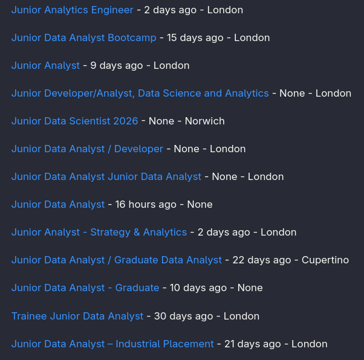

# Job Finder
Python CLI tool to generate a list of jobs matching certain requirements.
Currently searches for Junior Data Analyst positions in London. So just useful for me :)

## Installation
> git clone git@github.com:jppnhmr/job-finder.git

>pip install requirements.txt

## Usage
Add your RapidAPI key to usr_secrets.py

Query the JSearch API and create the Jobs Database
> python data_gathering.py

Find jobs from the database
> python analysis.py

This will create a markdown file containing a list of jobs with hyperlinks to apply.

### Example Output:

## TODO
- Add user input
- Expand job requirement options
- put more info into jobs_found.md
